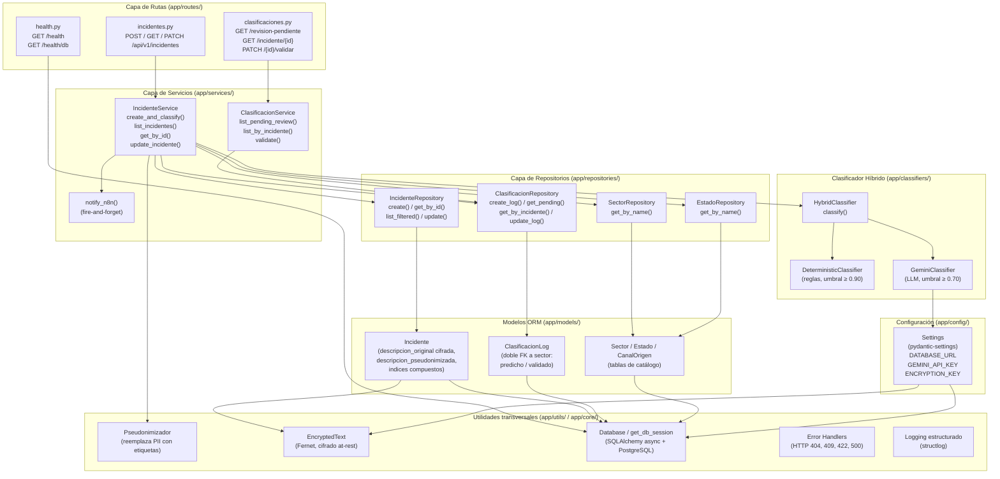

# Diagrama de Componentes — Módulo Python (Backend FastAPI)

Refleja la organización en capas del módulo `Gestion_Incidentes/app/`, siguiendo
el principio de separación de responsabilidades: cada capa solo conoce a la capa
inmediatamente inferior.

## Descripción de capas

| Capa | Directorio | Responsabilidad |
|------|-----------|-----------------|
| **Rutas** | `app/routes/` | Deserializar HTTP, delegar al servicio, serializar respuesta |
| **Servicios** | `app/services/` | Orquestar casos de uso (pseudonimizar, clasificar, persistir) |
| **Clasificadores** | `app/classifiers/` | Pipeline híbrido: determinístico → Gemini → fallback |
| **Repositorios** | `app/repositories/` | Acceso a datos; las queries de SQLAlchemy viven aquí |
| **Modelos ORM** | `app/models/` | Definición de tablas y relaciones (ver Anexo C) |
| **Utilidades** | `app/utils/` `app/core/` | Pseudonimizador, cifrado Fernet, logging, error handlers |
| **Configuración** | `app/config/` | `Settings` con pydantic-settings; sin defaults, valores en `.env` |
