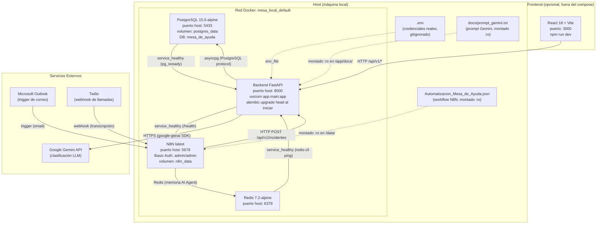

# Diagrama de Despliegue — Anexo A

Representa los servicios del entorno local definidos en `docker-compose.yml` (raíz del
repositorio). Todos los servicios corren dentro de la red Docker `mesa_local_default`.

> **Nota sobre el formato**: los diagramas se mantienen en Mermaid (texto versionable)
> en lugar de `.drawio` binario, para facilitar diffs en revisiones de código. Mermaid
> renderiza nativamente en GitHub y GitLab. (Decisión D1 del diseño de C-10.)

## Puertos del host

| Servicio   | Puerto host | Puerto contenedor | Protocolo |
|------------|------------|-------------------|-----------|
| postgres   | 5433       | 5432              | TCP       |
| redis      | 6379       | 6379              | TCP       |
| backend    | 8000       | 8000              | HTTP      |
| n8n        | 5678       | 5678              | HTTP      |
| frontend   | 3000       | 3000              | HTTP (dev)|

## Healthchecks

| Servicio | Comando                                   | Condición para dependientes |
|----------|-------------------------------------------|-----------------------------|
| postgres | `pg_isready -U mesa -d mesa_de_ayuda`     | `service_healthy`           |
| redis    | `redis-cli ping`                          | `service_healthy`           |
| backend  | `GET http://localhost:8000/health`        | `service_healthy`           |

El Frontend (React + Vite, puerto 3000) no está declarado en el compose y se levanta
de forma opcional con `npm run dev` en el directorio `Frontend/`. Ver
[`docs/operational-guide.md`](../operational-guide.md) para el procedimiento completo.
