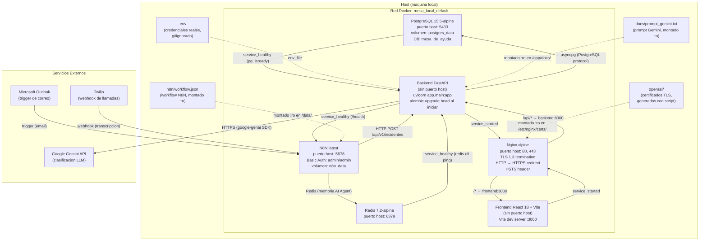

# Diagrama de Despliegue — Anexo A

Representa los servicios del entorno local definidos en `docker-compose.yml` (raíz del
repositorio). Todos los servicios corren dentro de la red Docker `mesa_local_default`.

> **Nota sobre el formato**: los diagramas se mantienen en Mermaid (texto versionable)
> en lugar de `.drawio` binario, para facilitar diffs en revisiones de código. Mermaid
> renderiza nativamente en GitHub y GitLab. (Decisión D1 del diseño de C-10.)

## Puertos del host

| Servicio   | Puerto host | Puerto contenedor | Protocolo        |
|------------|------------|-------------------|------------------|
| nginx      | 80         | 80                | HTTP (redirect)  |
| nginx      | 443        | 443               | HTTPS (TLS 1.3)  |
| postgres   | 5433       | 5432              | TCP              |
| redis      | 6379       | 6379              | TCP              |
| n8n        | 5678       | 5678              | HTTP (directo)   |
| backend    | —          | 8000              | HTTP (interno)   |
| frontend   | —          | 3000              | HTTP (interno)   |

> El backend (puerto 8000) y el frontend (puerto 3000) NO se publican en el host.
> Todo el trafico HTTP/HTTPS externo pasa a traves del proxy Nginx. N8N mantiene
> su puerto directo (5678) por limitaciones con path-prefix en el proxy.

## Healthchecks

| Servicio | Comando                                   | Condicion para dependientes |
|----------|-------------------------------------------|-----------------------------|
| postgres | `pg_isready -U mesa -d mesa_de_ayuda`     | `service_healthy`           |
| redis    | `redis-cli ping`                          | `service_healthy`           |
| backend  | `GET http://localhost:8000/health`        | `service_healthy`           |

El healthcheck del backend se ejecuta INTERNAMENTE en el contenedor (via
`http://localhost:8000/health`) y no se ve afectado por el proxy Nginx.
El frontend y Nginx usan `depends_on` con `condition: service_started`
(sin healthcheck propio).
