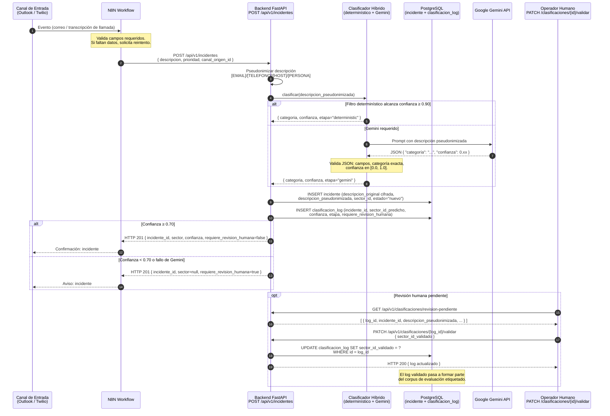

# Diagrama de Secuencia — Flujo Extremo a Extremo de un Incidente

Ilustra el flujo completo desde la recepción del incidente en un canal de entrada
hasta la confirmación al usuario o la derivación a revisión humana.

## Notas

- **Doble representación**: `descripcion_original` se cifra at-rest con Fernet (Ley 25.326);
  `descripcion_pseudonimizada` es la única que consume el clasificador y la API.
- **Umbral de confianza**: ≥ 0.70 para clasificación automática; < 0.70 deriva a revisión humana.
- **Etapas del clasificador**: `deterministic` (reglas, umbral ≥ 0.90) → `gemini` (LLM) → `fallback` (error).
- **N8N** actúa exclusivamente como orquestador de canales; toda la lógica de clasificación
  y persistencia reside en el backend FastAPI.
